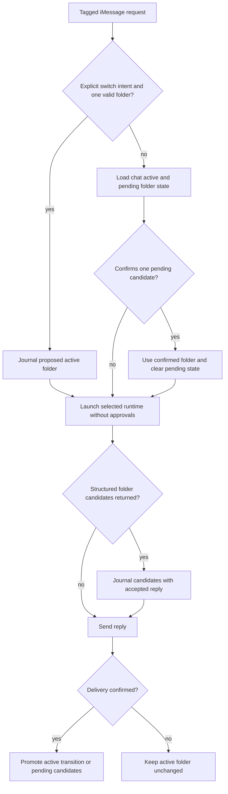

# Unattended Per-Chat Workspaces - Plan

## Goal Capsule

- **Objective:** Make setup establish a useful default working folder while allowing every iMessage chat to remember and change its own folder without interrupting agent turns for permission approval.
- **Product authority:** This contract owns setup folder selection, per-chat folder behavior, and unattended Claude Code and Codex permissions.
- **Open blockers:** None.

---

## Product Contract

### Summary

s4imsg will default to `~/s4imsg`, remember an active working folder independently for each chat, and let tagged requests switch folders by explicit path or confirmed natural-language discovery. Claude Code and Codex will run without approval prompts and with the unrestricted access available to the local macOS user.

### Problem Frame

The current setup uses the user's home directory as a working directory while testing runtime permissions against a separate temporary path. That mismatch can reject a usable runtime before installation. Inheriting interactive runtime permission settings also makes an unattended iMessage agent unreliable because no one is present at its terminal to answer approval prompts.

### Actors

- A1. The installer chooses the initial folder and accepts the machine-access trust model.
- A2. Any participant in an eligible iMessage chat can trigger the agent and request a folder change.
- A3. Claude Code or Codex executes the tagged request as the local macOS user.

### Key Decisions

- **Use `~/s4imsg` as the default folder** (session-settled: user-approved — chosen over `~/s4imsg-workspace`: the shorter path is easier to understand and remember). Governs R1-R2.
- **Remember the active folder per chat** (session-settled: user-directed — chosen over per-request or global persistence: separate conversations should retain separate project context). Governs R4 and R7.
- **Support explicit paths and natural-language discovery** (session-settled: user-directed — chosen over either mechanism alone: explicit requests stay fast while conversational requests remain useful). Governs R5-R6.
- **Run both runtimes with unrestricted no-prompt permissions** (session-settled: user-directed — chosen over folder containment or inherited runtime settings: tagged turns must never stall for approval). Governs R8-R11.

### Requirements

**Setup folder**

- R1. Setup must offer `~/s4imsg` as the default working folder while allowing the installer to enter another folder.
- R2. Setup must create a missing default folder, but an existing path must be shown to the installer and reused only after confirmation; setup must never overwrite or clear its contents.
- R3. Runtime qualification must exercise the same working-folder and permission behavior that installed turns will use.
- R12. Setup must expand `~`, store a canonical absolute directory, reject non-directories, and preserve an existing directory's contents and permissions.

**Per-chat context**

- R4. Every chat must persist its active folder independently, with new chats beginning in the setup default.
- R5. A tagged request with explicit folder-change intent and exactly one valid folder path must run that turn in the requested folder and make it durable only after the confirmation reply is delivered.
- R6. A tagged request that describes a folder without an explicit path may search for likely folders, but must ask for a numbered chat confirmation before switching; the pending choices expire after the next tagged request.
- R7. A confirmed folder change must apply to subsequent tagged turns in that chat without affecting other chats.
- R13. If a chat's stored folder is missing or inaccessible, s4imsg must report the path and explain that an explicit valid switch or `forget` restores operation instead of silently running elsewhere.
- R14. Forgetting a chat must also clear its active and pending folder state so the setup default applies again.

**Unattended permissions**

- R8. Claude Code and Codex must run tagged turns without presenting or waiting for approval prompts.
- R9. Runtime execution must not treat the active folder as a security boundary; the agent receives the unrestricted filesystem and command access available to the s4imsg process.
- R10. Setup must disclose that every current or future participant able to trigger the agent can cause actions anywhere the local macOS user can access, and that adding a participant or eligible chat does not trigger new consent.
- R11. Setup must stop before installation when either selected runtime cannot provide the required unrestricted no-prompt mode.
- R15. Existing installations that have not accepted the unrestricted trust contract must fail closed until setup is rerun and consent is renewed.
- R16. Setup must stop before installation and must not record accepted consent when the installer declines the unrestricted trust disclosure.

### Key Flows

- F1. Initial setup
  - **Trigger:** The installer runs setup.
  - **Actors:** A1, A3
  - **Steps:** Setup offers the default path, safely resolves any existing-path choice, presents the unrestricted trust disclosure, qualifies every selected runtime in unrestricted no-prompt mode, and installs only after all checks pass.
  - **Outcome:** New chats have a valid default working folder and selected runtimes can complete unattended turns.
  - **Covered by:** R1-R3, R8-R12
- F2. Explicit folder switch
  - **Trigger:** A participant tags the agent with an explicit folder path.
  - **Actors:** A2, A3
  - **Steps:** s4imsg validates the path, switches only that chat, and runs the request in the new context.
  - **Outcome:** Later turns in the same chat retain the folder.
  - **Covered by:** R4-R5, R7
- F3. Conversational folder discovery
  - **Trigger:** A participant asks to use a folder without supplying a path.
  - **Actors:** A2, A3
  - **Steps:** The agent identifies likely folders, asks the chat to confirm one, and switches only after confirmation.
  - **Outcome:** Ambiguous folder descriptions cannot silently redirect a chat.
  - **Covered by:** R4, R6-R7

### Acceptance Examples

- AE1. **Covers R1-R3.** Given `~/s4imsg` does not exist, when the installer accepts the default, then setup creates it and the live runtime probe operates under the same folder and permission contract as installed turns.
- AE2. **Covers R2.** Given `~/s4imsg` already contains a cloned repository, when setup reaches folder selection, then it asks whether to reuse that exact folder and does not alter its contents before confirmation.
- AE3. **Covers R4-R5, R7.** Given two chats have different active folders, when one chat explicitly switches paths, then its later turns use the new path and the other chat remains unchanged.
- AE4. **Covers R6.** Given a natural-language request matches multiple folders, when discovery completes, then no folder changes until the chat confirms one candidate.
- AE5. **Covers R8-R11.** Given a selected runtime would normally ask for tool approval, when setup qualifies it and when a tagged turn runs, then s4imsg uses unrestricted no-prompt execution; if that mode is unavailable, setup fails before installation.

### Scope Boundaries

- s4imsg will not create a separate project folder for every chat.
- The active folder is working context, not a filesystem sandbox or access-control boundary.
- Runtime approval prompts and inherited restrictive permission modes are outside the supported installed-turn behavior.
- macOS privacy controls remain authoritative; s4imsg does not bypass operating-system permissions the process has not received.

### Dependencies / Assumptions

- The installer trusts every participant in each eligible chat with the local macOS user's effective machine access.
- Selected Claude Code and Codex versions expose an unrestricted noninteractive execution mode.
- Folder discovery may inspect the filesystem locations the s4imsg process can access.

---

## Planning Contract

### Key Technical Decisions

- KTD1. **Version unrestricted consent in configuration.** Add an explicit accepted trust-contract version and reject legacy configs at daemon startup until setup rewrites them. This prevents an upgrade from silently broadening an existing installation's authority. (session-settled: user-approved — chosen over silently inheriting consent: unrestricted access must remain explicit.)
- KTD2. **Use production bypass flags in both qualification and installed turns.** Claude Code receives `--dangerously-skip-permissions`; Codex receives `--dangerously-bypass-approvals-and-sandbox`. Qualification keeps its marker outside the selected working folder to prove that the runtime accepts its unrestricted flag and can perform one noninteractive write outside the workspace. It does not prove access through separate macOS privacy controls or every path-specific policy. Covers R3 and R8-R11.
- KTD3. **Keep the configured `workingDirectory` as the installation default.** Setup changes its fresh default to `~/s4imsg` and preserves the existing value plus `chatKeySalt` on rerun. A dedicated workspace helper canonicalizes and creates directories without applying private-state permissions. Covers R1-R3 and R12.
- KTD4. **Store per-chat workspace state separately from conversational memory.** A schema migration adds a workspace table keyed by the existing opaque `chat_key`; the configured directory remains the fallback when no row exists. `forget` clears both active and pending workspace state. Covers R4, R7, and R14.
- KTD5. **Resolve only intentional explicit switches before runtime launch.** A bounded host parser requires folder-change language such as “use,” “work in,” or “switch to,” followed by exactly one standalone absolute or home-relative path. Quoted paths support spaces. A mere path mention, an invalid path, or multiple path candidates does not switch. The validated directory becomes the effective directory for that turn. Covers R5 and R13.
- KTD6. **Use structured runtime output for conversational discovery.** Runtime output may carry bounded workspace candidates. The host filters invalid candidates, canonicalizes the rest, assigns stable one-based numbers in the delivered reply context, and promotes the set to pending state only after delivery is confirmed. The next tagged request may select one by exact number or canonical path; bare affirmation is accepted only for a single pending candidate. That request consumes the pending set whether or not it selects a folder. Covers R6-R7 and R13.
- KTD7. **Keep workspace transitions consistent with observable execution.** An explicit switch is journaled as a proposed active directory, used for the current runtime invocation, and promoted to durable chat state only after its confirmation reply is delivered. A discovered candidate is promoted to pending state only after its proposal reply is delivered. A later valid selection becomes effective before its runtime launch and follows the same delivered-confirmation rule. Recovery remains idempotent by associating workspace transitions with their delivery event. Covers R5-R7.
- KTD8. **Treat project instructions as part of unrestricted execution.** Claude Code and Codex may load user and project configuration, hooks, MCP servers, and instructions from the selected folder. Setup and public security docs disclose that switching into an untrusted repository can therefore influence a machine-wide agent. Covers R9-R10.
- KTD9. **Make legacy recovery actionable.** A daemon that rejects an older consent version must say that unrestricted access now requires renewed consent and instruct the owner to run `s4imsg setup`. Setup preserves the existing chat-key salt and working folder unless the owner changes them. Covers R15.

### High-Level Technical Design

### Implementation Constraints

- The selected working folder is never an authorization boundary.
- No runtime may receive an interactive stdin or TTY path during qualification or daemon execution.
- Primary and fallback attempts for one event must receive byte-identical prompt context and the same resolved working directory.
- Host-side folder state must use canonical existing directories; a missing stored directory is an actionable turn failure, not a fallback condition.
- Authentication and macOS Full Disk Access or Messages Automation remain human-only prerequisites and can still block setup or execution.
- Existing workspace folders must not be chmodded, cleared, or populated merely by selecting them.

### System-Wide Impact and Risks

- Unrestricted runtimes can modify s4imsg's config, database, source, or any other file available to the macOS user. The disclosure and `SECURITY.md` must state this plainly.
- Untagged conversation evidence can prompt-inject the runtime. It remains labeled as untrusted, but no sandbox limits the effect of a successful injection.
- Repository-controlled instructions, hooks, and MCP configuration may execute with unrestricted access after a folder switch. The user must trust the selected repository as well as chat participants.
- A setup rerun that changes `chatKeySalt` would orphan all per-chat state. Rerun behavior must preserve the salt.

### Sequencing

Land U1 (consent versioning and setup workspace selection) and U2 (unrestricted runtime flags) first so every later live probe uses the intended security contract. Then land U3 (durable per-chat workspace state) and U4 (turn routing and delivery recovery). Finish with U5 (documentation and release gates).

---

## Implementation Units

### U1. Version consent and select the setup workspace

- **Goal:** Establish a safe fresh default and require explicit unrestricted-access consent for new and upgraded installations.
- **Requirements:** R1-R2, R10, R12, R15-R16.
- **Files:** `src/config.ts`, `src/cli.ts`, `src/macos/setup.ts`, `src/core/daemon.ts`, `test/unit/setup.test.ts`, `test/unit/config.test.ts`.
- **Approach:** Add a trust-contract version to config validation. Record it only after typed affirmative consent, and abort without writing it when consent is declined. Daemon startup rejects an absent or stale version with an actionable `s4imsg setup` message. Preserve the existing salt and working directory when setup reruns. Add a testable path resolver that expands `~`, canonicalizes directories, creates missing selections, confirms existing selections, and never alters an existing directory's permissions or contents.
- **Test Scenarios:** Fresh default creation; existing default accept/decline; custom home-relative path; existing file rejection; salt preservation; disclosure decline writes no consent or config; daemon refuses a legacy config with an actionable setup command until renewed consent.
- **Verification:** Focused setup and config unit tests pass.

### U2. Run and qualify Claude Code and Codex without prompts

- **Goal:** Make the exact installed runtime invocation unrestricted and noninteractive.
- **Requirements:** R3, R8-R11.
- **Files:** `src/runtimes/claude.ts`, `src/runtimes/codex.ts`, `src/runtimes/qualification.ts`, `scripts/release-validate.ts`, `test/unit/runtime-adapters.test.ts`, `test/unit/runtime-qualification.test.ts`.
- **Approach:** Add each runtime's dangerous bypass flag, require the flag in help qualification, retain the external temporary marker, and reverse release checks that forbid bypass modes.
- **Test Scenarios:** Exact flags present; unsupported CLI fails qualification; external marker succeeds from the selected cwd; no interactive input path exists.
- **Verification:** Runtime adapter, qualification, and release-validation tests pass.

### U3. Persist chat-scoped workspace state

- **Goal:** Give each opaque chat key independent active and pending folder state across restarts.
- **Requirements:** R4, R7, R13-R14.
- **Files:** `src/storage/migrations.ts`, `src/storage/workspaces.ts`, `src/storage/memory.ts`, `src/storage/journal.ts`, `test/unit/migrations.test.ts`, `test/unit/workspaces.test.ts`, `test/unit/journal.test.ts`.
- **Approach:** Add a schema migration and a `WorkspaceStore`. Journal effective directories, proposed active transitions, and discovery candidates. Promote workspace state only when delivery is confirmed. Clear workspace state during forget.
- **Test Scenarios:** Migration from the prior schema; two-chat isolation; restart persistence; pending proposal delivery and ambiguity behavior; forget reset; missing directory detection.
- **Verification:** Storage and journal unit tests pass.

### U4. Route turns through the active chat workspace

- **Goal:** Switch explicit paths immediately and support safe conversational discovery and confirmation.
- **Requirements:** R4-R7, R13.
- **Files:** `src/core/daemon.ts`, `src/core/turn.ts`, `src/runtimes/types.ts`, `test/integration/turn-lifecycle.test.ts`, `test/unit/runtime-output.test.ts`.
- **Approach:** Resolve explicit switch intent and pending confirmation before constructing runtime input. Add trusted active/default/pending workspace state to the prompt and a bounded structured candidate field to runtime output. Validate every candidate in the host. Consume pending state after the next tagged request. Use the same resolved directory for primary and fallback.
- **Test Scenarios:** Explicit switch affects the same turn and becomes durable after delivery; mere path mentions do not switch; failed or ambiguous replies do not make a proposed switch durable; later turns retain confirmed switches; another chat stays on default; numbered discovery does not switch before confirmation; a valid next-turn confirmation runs in the candidate folder and makes it durable after delivery; stale, cross-chat, invalid, and ambiguous candidates cannot switch; deleted active folder refuses execution; fallback context remains identical.
- **Verification:** Turn-lifecycle integration tests and runtime-output validation tests pass.

### U5. Align documentation and release evidence

- **Goal:** Make public guidance accurately describe the unattended security model and workspace UX.
- **Requirements:** R1-R16.
- **Files:** `README.md`, `SECURITY.md`, `docs/RELEASE_QUALIFICATION.md`, `docs/LIVE_SMOKE.md`.
- **Approach:** Replace the old inherited-permission contract with explicit unrestricted behavior, explain `~/s4imsg` and per-chat switching, document renewed consent for upgrades, and add live checks for default creation, two-chat isolation, discovery confirmation, and macOS privacy prerequisites. State that repository-controlled instructions, hooks, and MCP configuration receive the same unrestricted authority when a folder is selected.
- **Test Scenarios:** Documentation contains no contradictory claims that bypass flags are forbidden or runtime defaults are inherited, and `SECURITY.md` states the repository-controlled instruction, hook, and MCP execution risk.
- **Verification:** Release validation and repository text search find no stale contract language.

---

## Verification Contract

| Gate | Command | Proves |
|---|---|---|
| Types | `bun run typecheck` | Config, storage, runtime output, and turn contracts compose. |
| Unit and integration tests | `bun test` | Setup, adapters, migrations, recovery, and per-chat behavior meet the requirements. |
| Compiled artifact | `bun run build` | The standalone CLI still produces its distributable binary. |
| Release policy | `bun run release:validate` | Public-repo, dependency, workflow, and intentional runtime-bypass policies pass. |
| Diff hygiene | `git diff --check` | No whitespace or conflict-marker defects remain. |

Live verification must run setup against both installed runtimes when available. It must show the disclosure before the unrestricted probe, verify the external marker is cleaned up, and exercise one explicit switch plus one discovery-confirmation flow across two chats before release.

---

## Definition of Done

- U1 is done when fresh and legacy setup paths require the correct consent, daemon startup refuses stale consent with an actionable setup command, and setup creates or reuses a canonical workspace without mutating existing contents or permissions.
- U2 is done when Claude Code and Codex use their documented unrestricted flags in both qualification and installed turns with no approval prompt path.
- U3 is done when active and pending workspace state survives restart, remains chat-isolated, follows delivery recovery, and resets on forget.
- U4 is done when explicit switching affects the same turn, discovery requires confirmation, invalid state fails safely, and fallback context remains identical.
- U5 is done when README, security guidance, smoke tests, and release qualification describe the shipped behavior without contradictions.
- All Verification Contract gates pass.
- No abandoned experiments, stale assertions, temporary files, or unrelated changes remain in the diff.
- No launch-blocking open question remains.
